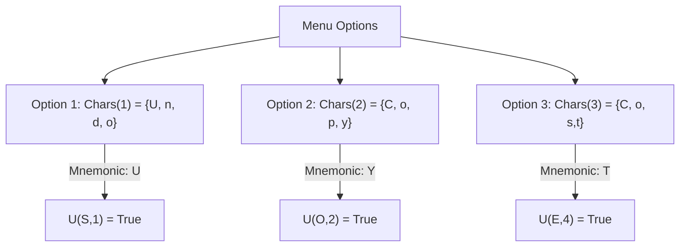

Assigning unique keyboard mnemonics to menu options is a common challenge in user interfaces. This
involves ensuring that each option in a menu has a unique mnemonic, a single character shortcut that
activates that option. The challenge becomes more complex when trying to guarantee uniqueness across
all options.

## The Problem

A keyboard mnemonic is a shortcut character that you can use to select an option quickly. For
example, if 'U' is the mnemonic for the "Undo" option, you might press 'U' to activate it.

Consider a menu with options like "cut," "copy," and "cost." The goal is to assign a unique mnemonic
to each option such that:

1. Each option has one and only one mnemonic.
2. No two options share the same mnemonic.

## SAT-Based Solution

The problem can be transformed into a Boolean Satisfiability Problem (SAT), a classic problem in
computer science where the task is to determine if there exists an assignment of true/false values
to variables that makes a Boolean formula true.

### What is SAT?

[SAT (Boolean Satisfiability Problem)](https://www.cs.princeton.edu/courses/archive/fall21/cos326/lec/23-01-sat.pdf)
is a decision problem that asks whether a given Boolean formula can be satisfied by some assignment
of truth values. SAT solvers are algorithms that solve SAT problems and have wide applications in
fields like hardware verification, software testing, automated reasoning, and cryptography.

## Formalizing the Problem

Each option `i` in the menu has a set of characters associated with it, a set called $Chars(i)$. For
instance, if option `1` is "Undo", $Chars(1)$ might be the set of characters $\{U, n, d, o\}$.

The task is to determine whether a particular character `c` is the mnemonic for a specific `i`.

The menu with $n$ options such that $i \in \{1,...,n\}$. We denote the set of characters $Chars(i)$
that belong to the $i$-th option. Therefore, our problem can be defined as:

$$
\{U_{c,i} | 1 \leq i \leq n, c \in Chars(i)\}
$$

Here, $U_{c,i}$ is true if the character c is the mnemonic of the i -th option.



### Constraints

To solve the problem correctly, we need to define three key constraints:

#### 1. Each Option Must Have a Mnemonic

This constraint ensures that every option has at least one character assigned as its mnemonic.
Formally, for each option `i`, at least one of the Boolean variables $U_{c,i}$ must be `true`:

$$
\land_{i = 1}^n \lor_{c \in Chars(i)} U_{c,i}
$$

This expression means that for every option `i`, there is at least one character `c` in `Chars(i)`
for which $U_{c,i}$ is true.

**Example**: Consider the options "undo", "copy", and "cost". We would express this as:

$$
U_{u,1} \lor U_{n,1} \lor U_{d,1} \lor U_{o,1} \quad \text{(option 1: "undo")}
$$

$$
U_{c,2} \lor U_{o,2} \lor U_{p,2} \lor U_{y,2} \quad \text{(option 2: "copy")}
$$

$$
U_{c,3} \lor U_{o,3} \lor U_{s,3} \lor U_{t,3} \quad \text{(option 3: "cost")}
$$

Each of these logical statements guarantees that an option has at least one mnemonic.

#### 2. An Option Cannot Have More Than One Mnemonic

This constraint ensures that each option has only one character assigned as its mnemonic, meaning
that if a character is chosen, no other character for the same option can be a mnemonic.

Formally, for each option `i` and each character `c` in `Chars(i)`, if $U_{c,i}$ is `true`, then all
other characters `t` in `Chars(i)` must have $U_{t,i}$ set to `false`:

$$
\land_{i = 1}^n \land_{c \in Chars(i)} \left(U_{c,i} \implies \land_{t \in Chars(i) \setminus \{c\}} \lnot U_{t,i}\right)
$$

This expression means that if a character `c` is chosen as the mnemonic for option `i`, then no
other character in `Chars(i)` can be the mnemonic for that option.

**Example**: Continuing with the example, this constraint for the first option "undo" might look
like:

$$
U_{u,1} \implies \lnot U_{n,1} \land \lnot U_{d,1} \land \lnot U_{o,1}
$$

$$
U_{n,1} \implies \lnot U_{u,1} \land \lnot U_{d,1} \land \lnot U_{o,1}
$$

And similarly for the other options.

#### 3. A Character Cannot Be a Mnemonic for Multiple Options

This constraint ensures that no single character is used as the mnemonic for more than one option.
Formally, for each option `i` and each character `c` in `Chars(i)`, if $U_{c,i}$ is `true`, then `c`
cannot be the mnemonic for any other option `j` where `j ≠ i`:

$$
\land_{i = 1}^n \land_{c \in Chars(i)} \left(U_{c,i} \implies \land_{1 \leq j \leq n, j \neq i} \lnot U_{c,j}\right)
$$

This expression prevents the same character `c` from being assigned to more than one option.

**Example**: Suppose the character `o` appears in both "undo" and "cost". We need to ensure that if
`o` is selected as the mnemonic for "undo" ($U_{o,1}$), it cannot also be the mnemonic for "mod"
($U_{o,3}$):

$$
U_{o,1} \implies \lnot U_{o,3}
$$

And similarly, for any character that appears in multiple options.

### Putting It All Together

The entire problem is expressed as a combination of these constraints. We feed these logical
expressions into a SAT solver like Z3, which will determine whether there is a way to assign
mnemonics that satisfies all the constraints. If such an assignment exists, the SAT solver will
provide the solution.

## Implementing the SAT Solver in TypeScript

With the formalization in place, let's now dive into the implementation. We'll use TypeScript to
encode the problem and leverage the [Z3 solver](https://www.npmjs.com/package/z3-solver) to find a
solution.

### z3-solver

[z3-solver](https://www.npmjs.com/package/z3-solver) is the library that provides bindings to the Z3
theorem prover. The key components we will use are:

- **Context:** The environment where variables and formulas are defined.
- **Bool** The Boolean type used to define variables.
- **And, Or, Not:** Logical operators used to build formulas.

### Workflow

The steps are as follows:

- **Initialization:** The Z3 context is initialized.
- **Parsing Options:** The menu options are parsed into mnemonic objects using parseOptions.
- **Adding Constraints:** The constraints for unique mnemonics and character restrictions are added/
- **Solving:** The solver attempts to find a solution that satisfies all constraints.
- **Output:** If the problem is satisfiable, the mnemonics for each option are printed.

### Initialize Z3 and create a solver

This is necessary for creating and solving logical formulas. The `init()` function initializes the
Z3 environment, and `Context("main")` creates a context named “main” where all the Z3 operations
will be performed.

```ts
let { Context, em } = await init();
const Z3 = Context("main");
let solver = new Z3.Solver();
```

### Mnemonic interface

The Mnemonic interface defines the structure of a mnemonic object. A mnemonic, in this context,
refers to a specific character in a menu option that can be used as a keyboard shortcut. The purpose
of the Mnemonic interface is to encapsulate all the relevant information about a mnemonic character,
including its position in the menu and its corresponding boolean value used by the Z3 solver.

```ts
interface Mnemonic {
  character: string;
  position: { i: number; j: number };
  value: BoolZ3<"main">;
}
```

Let’s break down each part of the Mnemonic interface.

- `character: string` - This field represents the actual character from the menu option that is
  being considered as a mnemonic. For example, in the menu option “copy”, the characters ‘c’, ‘o’,
  ‘p’, and ‘y’ could all be potential mnemonics.
- `position: { i: number; j: number }` - The position field is an object that stores the location of
  the character within the menu option and the overall list of options. It has two components:
  - `i` The index of the menu option in the overall list of options. For example, in the options
    array ["undo", "copy", "mod"], “undo” would have i = 0, “copy” would have i = 1, and so on.
  - `j` The index of the character within the specific menu option. For example, in the word “undo”,
    ‘u’ would have j = 0, ‘n’ would have j = 1, and so on.
- `value: BoolZ3<"main">` - This field represents a boolean constant created by the Z3 solver that
  corresponds to the mnemonic character. The `BoolZ3<"main">` type indicates that this is a boolean
  value used in the context of the Z3 solver’s logical constraints. This boolean value will be true
  if the character is chosen as the mnemonic for the option, and false otherwise. For example: If
  `d`is considered as a mnemonic for `undo` and is selected by the solver, value would represent the
  boolean constant `Uu0` and its value would be evaluated as true by the solver.

### Parsing Options into Boolean Variables

The first step is to convert each character in the options into a boolean variable that the Z3
solver can work with.

```ts
function parseOptions(options: string[], Bool: BoolCreation<"main">): Mnemonic[][] {
  const newOptions = options.map((option) => Array.from(new Set([...option])));
  return newOptions.map((option: string[], positionInMenu: number) => {
    return option.map((character, positionInOption: number) => ({
      character: character,
      position: { i: positionInMenu, j: positionInOption },
      value: Bool.const(`U${character}${positionInMenu}`),
    }));
  });
}
```

### Defining variables

For each option and each character within that option, we define a Boolean variable that represents
whether that character is chosen as the mnemonic for the option:

```ts
const chars = OPTIONS.map((opt) => Array.from(opt));
const U = chars.map((chars_i, i) => chars_i.map((c) => ctx.mkBoolConst(`U_${c}_${i}`)));
```

- `chars` is an array that contains the characters of each option.
- `U` is a two-dimensional array where U[i][j] represents whether character j of option i is the
  selected mnemonic.

### Defining constraints

Now, we add the constraints to the solver following this approach:

```ts
options.forEach((option) => {
  solver.add(Or(...U[i]));
});
```

#### Solving the Problem

Once the constraints are added, we use the Z3 solver to check if a solution exists that satisfies
all constraints:

```ts
if (solver.check() === Z3.SATISFIABLE) {
  const model = solver.model();
  options.forEach((option, i) => {
    option.forEach((mnemonic, j) => {
      if (model.eval(U[i][j]).isTrue()) {
        console.log(`Mnemonic for ${option} is ${chars[i][j]}`);
      }
    });
  });
}
```

In this code, `solver.check()` determines if the constraints are satisfiable. If the problem is
satisfiable (Z3.SATISFIABLE), the solver will provide a solution. We then iterate over each option
and its characters, checking the model to see which mnemonic was selected.

## Implementation

For more details and the complete implementation, visit the
[GitHub repository](https://github.com/flandrade/sat-solver-ts).

## Acknowledgment

Assignment from "Static Program Analysis and Constraint Solving" at Universidad Complutense de
Madrid. Prof. Manuel Montenegro.
